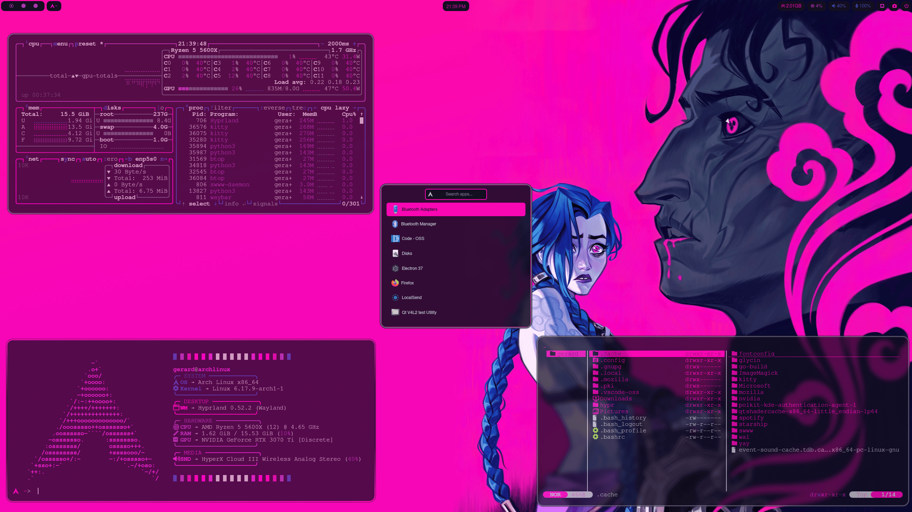
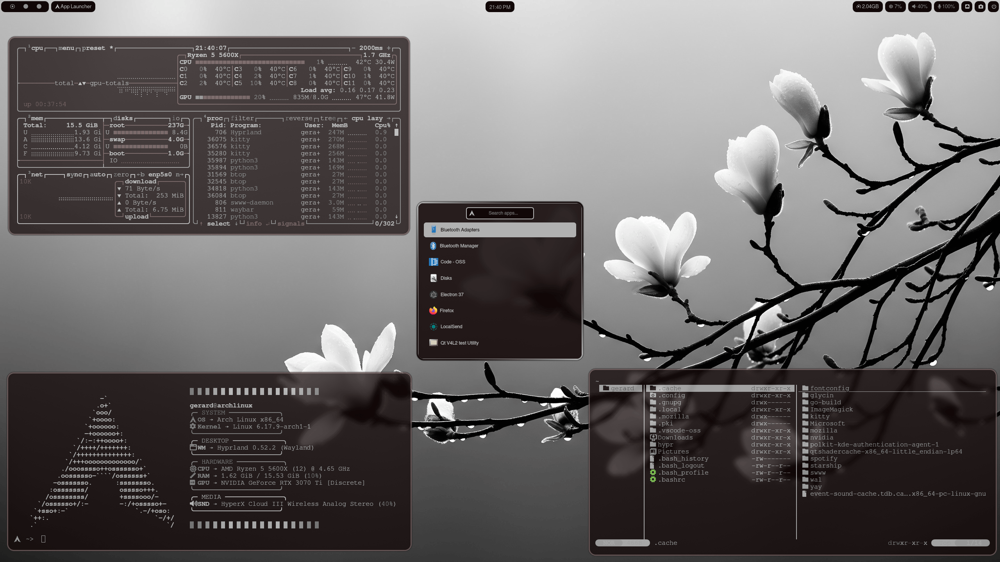
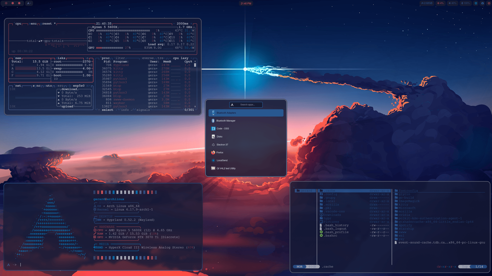

☕ Saltyfunnel’s Hyprland Config – Made by a Noob Who’s Slowly Becoming Less of One (Somehow)

Welcome to my Hyprland rice.
Before you go any further, let me be painfully honest:

I had absolutely no idea what I was doing when I started this.
Like… negative idea.
The kind of noob who breaks things by looking at them.
But over time (and with a frankly embarrassing amount of AI assistance), I’ve crawled my way into being a “semi-functional beginner who occasionally understands things.”

So yeah — this repo is a mix of:

accidental successes

configs I copied but now kind of understand

my own trial-and-error disasters

AI filling in the brain cells I didn’t have that day
## 🖼️ Screenshots

### **The Pywal Dynamic**
A demonstration of how the **`setwall.sh`** script automatically changes the system's color scheme (Waybar, Terminal, and Pickers) to match the wallpaper, showcasing the fluid nature of the config.

#### **Example 1: Tiled Windows and Waybar**
This shows the clean default layout with Hyprland tiling, the Waybar, and the dynamically generated color scheme.


#### **Example 2: Theme Change Example (Wallpaper 1)**


#### **Example 3: Theme Change Example (Wallpaper 2)**


#### **Example 4: Theme Change Example (Wallpaper 3)**


### **The Custom Picker**
A shot of the homemade PyQt6 Wallpaper Picker in action, which sends the chosen image to the Pywal theme generation script.


💡 Startup Notes (a.k.a. How to Ruin Your Day Early)

On the very first launch after installation, you might see a small Hyprland error. This is normal! It just means the auto-theming script hasn't picked a wallpaper yet.

The Fix (Quick & Permanent):

    Press the keybind SUPER + w to launch the custom wallpaper chooser.

    Select any wallpaper from the list.

Choosing a wallpaper will run the theming script, resolve the initial error, and start your colorful, dynamic desktop.

## 🧩 The Stack (AKA “Things I Installed And Pray Don’t Update”)

| Tool           | Description                                                                     |
| -------------- | ------------------------------------------------------------------------------- |
| Hyprland       | The compositor, the only thing here that isn't held together by string and luck |
| swww           | The wallpaper thingy                                                            |
| mako           | For notifications when everything breaks                                        |
| python-pywal16 | The color generator controlling the mood swings                                 |
| PyQt6          | Used for custom GUI pickers nobody asked for                                    |
| Waybar         | The bar that changes themes more often than some people change underwear        |
| Yazi           | File manager that also gets re-themed because why not                           |

## 🛠 The Scripts (Where the Crimes Are Committed)

Everything lives in `~/.config/scripts/` because that felt right at the time.

### 1. `install.sh`

An Arch Linux setup script that:

* Installs dependencies
* Copies configs
* Asks the user to run it with `sudo`, which is always safe and never dangerous at all

Please read it before running. Or don’t. I’m not your mom.

### 2. `setwall.sh`

The “core logic,” if you can call it that. It:

* Picks a wallpaper (or grabs a random one because chaos)
* Runs pywal to generate a palette
* Force-rewrites configs for Waybar, Yazi, and Mako
* Reloads them and hopes nothing crashes

It’s basically a color-themed Rube Goldberg machine.

### 3. `wallpaper-picker.py` & `app-picker.py`

Two PyQt6 scripts replacing good, working tools with homemade knockoffs that match the theme:

* **Wallpaper Picker**: Browse wallpapers and send the chosen one into the theme grinder
* **App Picker**: A Pywal-themed launcher with “please work” energy

## ⌨️ Keybinds

| Shortcut          | What It Does                      | Script              |
| ----------------- | --------------------------------- | ------------------- |
| SUPER + w         | Launch wallpaper picker           | wallpaper-picker.py |
| SUPER + Space     | Launch app picker                 | app-picker.py       |
| SUPER + Shift + s | Screenshot with mako notification | Helper script       |

## ⚠️ Installation

If you’re not on Arch, just stop now.
If you *are* on Arch… still maybe think about your life choices.

```bash
git clone https://github.com/Saltyfunnel/hypr
cd hypr
chmod +x scripts/*.sh
cd scripts
sudo sh install.sh
```

If something breaks, you now own all the pieces.

## 🙌 Credits

* **ChatGPT / Claude / Gemini** — The real developers
* **pywal devs** — Turning questionable color ideas into vibes
* **r/unixporn** — The inspiration for bad decisions at 3AM

## 🔥 Final Thoughts

This repo isn’t about elite Linux mastery.
It’s about proving that with enough AI help, confidence, and blind ambition, anyone can make a desktop that looks like a professional spent weeks on it.

Just… maybe don’t ask me what half the scripts are doing.
