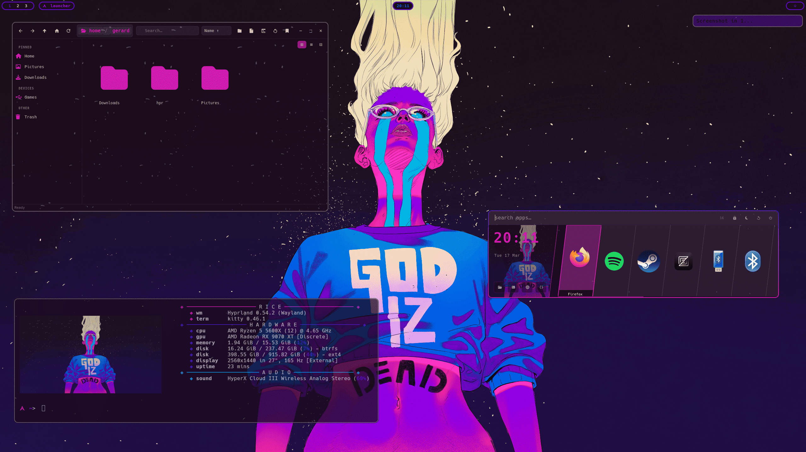

# hyprland · arch linux · 2026

> automated desktop environment installer — AMD / NVIDIA / Intel

---

## what it does

one script. boots you straight from a fresh arch install into a fully configured hyprland desktop.

- **system update** — `pacman -Syu` before anything touches the disk
- **gpu detection** — reads `lspci`, installs the right drivers automatically (nvidia-open-dkms / amdgpu / intel mesa + vulkan)
- **packages** — hyprland, waybar, swww, kitty, mako, sddm, fastfetch, starship, btop, and ~50 others in one shot
- **aur** — builds yay from source if absent, then pulls pywal16 + pywalfox
- **dotfiles** — drops your configs into `~/.config/*`, writes a sensible `.bashrc`
- **pywal theming** — symlinks wal cache into waybar, mako, hyprland so colours update with your wallpaper
- **gpu env** — writes a `hypr/gpu-env.conf` with the correct wayland/vulkan vars for your hardware
- **services** — enables sddm, bluetooth, NetworkManager

---

## features

**dynamic theming** — full pywal integration, system colours sync automatically with your wallpaper

---

## screenshots




---

## installation

> only tested on a minimal arch base install

```bash
git clone https://github.com/Saltyfunnel/hypr
cd hypr
chmod +x install.sh
sudo ./install.sh
```

---

## first launch

on the very first boot you may see a small hyprland error — this is expected. the theming script hasn't picked a wallpaper yet.

**fix:** press `super + w`, select any wallpaper. that's it.

---

## keybinds

| keys | action |
|---|---|
| `super + return` | terminal |
| `super + d` | launcher |
| `super + q` | close window |
| `super + f` | file manager |
| `super + w` | wallpaper picker |
| `super + b / c / i` | browser · editor · monitor |
| `super + v` | toggle float |
| `super + h/j/k/l` | focus ← ↓ ↑ → |
| `super + [1–5]` | switch workspace |
| `super+shift + [1–5]` | move to workspace |

---
