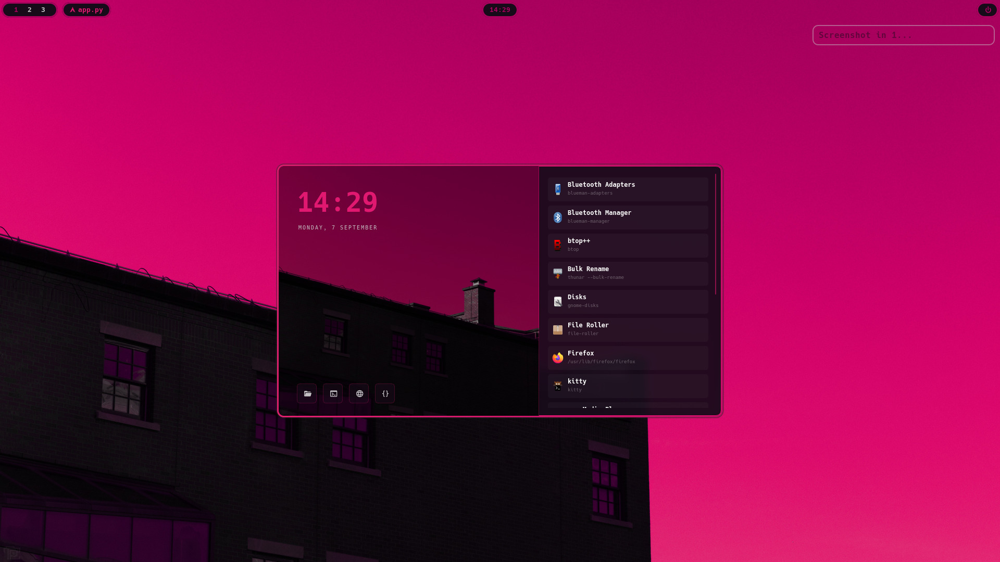

# Hyprland Installer (2026 Edition)

An automated Arch Linux setup script that installs and configures a complete Hyprland desktop environment with dynamic hardware detection and custom theme integration.

---

## Previews

<p align="center">
  
  
</p>

---

## Features

* **GPU Auto-Detection:** Automatically detects Nvidia, AMD, or Intel graphics cards and installs appropriate drivers and Wayland environment variables.
* **No-AUR Pywal16:** Installs `pywal16` cleanly via `pipx` from PyPI.
* **Theme & Style Integration:** Configures GTK dark themes, installs Colloid Dynamic icons, and links dynamic Pywal colors for Waybar, Mako, and Zed.
* **Full Application Suite:** Sets up SDDM, Waybar, Mako, Kitty, Thunar, Starship, btop, and Fastfetch automatically.
* **Wallpapers Included:** Clones and deploys custom wallpaper collections on setup.

---

## System Requirements

* **OS:** Arch Linux (clean installation recommended)
* **Privileges:** Root / Sudo access
* **Package Manager:** `pacman` with active internet connection

---

## Quick Start

```bash
git clone [https://github.com/Saltyfunnel/hypr.git](https://github.com/Saltyfunnel/hypr.git)
cd hypr
chmod +x install.sh
sudo ./install.sh
